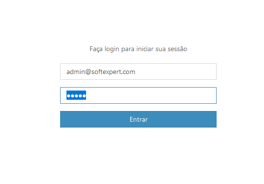
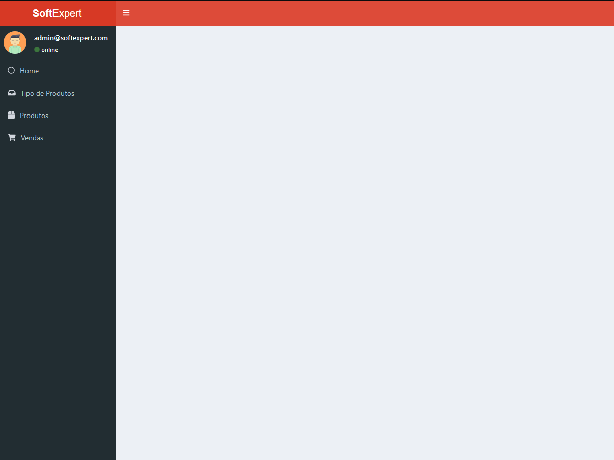
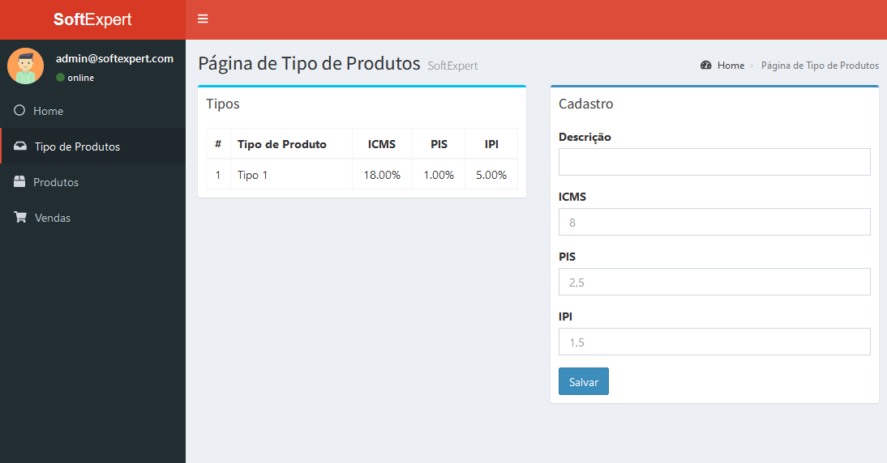
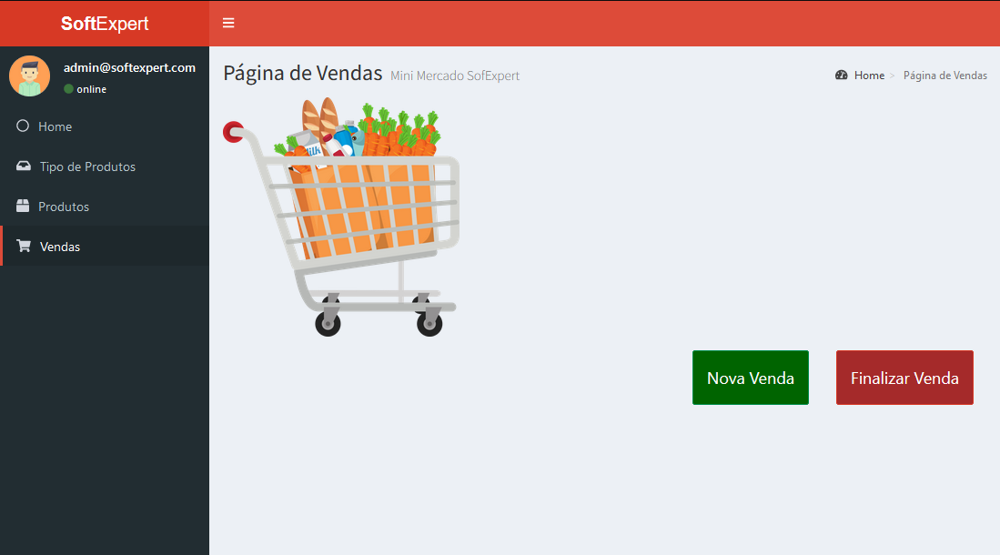
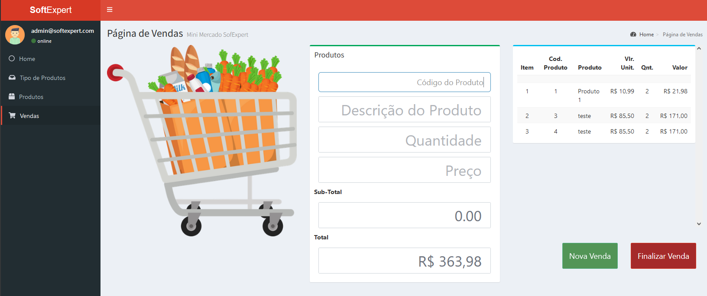
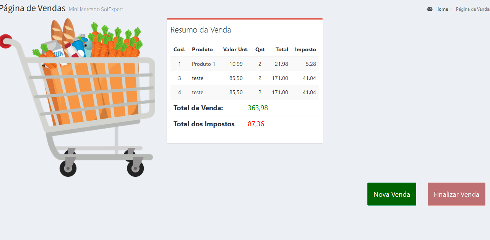

<h1>Frontend </h1>

## Índice

- [Objetivo](#objetivo)
- [Pré-requisitos](#requisitos)
- [Executando o Projeto](#usage)
- [Frontend](#front)
- [Tecnologias Utilizadas](#utils)
- [Links](#links)
- [Licença](#license)
- [Autor](#autor)

## 🎯 Objetivo do Projeto <a name = "objetivo"></a>

<p>O projeto do frontend foi feito em React com o tamplate admin-lte.
Caso queira rodar o projeto em sua máquina, poderá realizar de duas formas, a primeira
é pegar já uma cópia já renderizado na pasta <b>build</b>, a outra forma irei mostrar em seguida.
</p>

## 🛑 Pré-requistos para rodar o Projeto <a name = "requisitos"></a>

- [x] NodeJS

## Executando o Projeto <a name = "usage"></a>

Após o clone, na pasta do frontend, execute o seguinte comando.
```
  npm install
```

Após a instalação rode o projeto
```
 npm run start
```
### Credenciais
<p>Use as seguintes credenciais para ter acesso ao sistema:</p>


```
usuario: admin@softexpert.com
senha: admin
```
### Tela Inicial


### Tela de Cadastro de Tipo de Produtos


### Tela de Cadastro de Produtos


### Tela de Cadastro de Vendas


### Realizando uma venda


### Venda Finalizada



<a href="#top">Voltar para o topo</a>

------------


